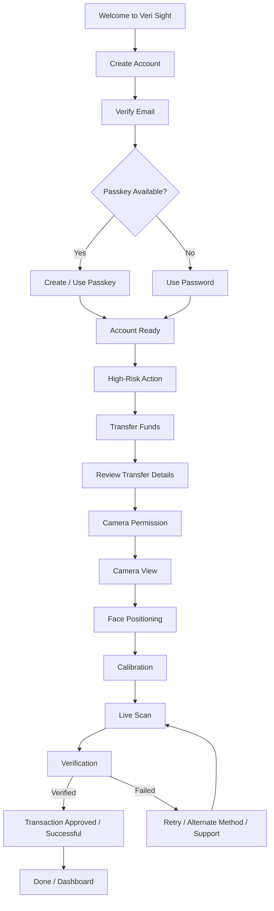

# Veri Sight

> **Secure trading starts here.**  
> **Secure. Fast. Seamless Onboarding.**

Veri Sight is a **UX/UI design concept for secure financial onboarding and high-risk transaction verification**. The experience is designed around a simple principle: sensitive actions should feel protected without making the user feel blocked or confused.

The project brings together **account onboarding, email verification, passkey authentication, camera-based identity verification/liveness, protected fund transfers, clear recovery states, account security, support, and accessibility considerations** into one connected user journey.

The work is documented as a progression from **low-fidelity UX flows to mid/high-fidelity screens and prototype interactions**, with dedicated states for success, failure, loading, permissions, timeout, cancellation, and recovery.

---

## Table of Contents

- [Project Overview](#project-overview)
- [Design Goal](#design-goal)
- [Core Experience](#core-experience)
- [End-to-End User Journey](#end-to-end-user-journey)
- [User Flows](#user-flows)
- [Screen Inventory](#screen-inventory)
- [Verification & Liveness Experience](#verification--liveness-experience)
- [Error Handling & Recovery](#error-handling--recovery)
- [Account, Security & Support](#account-security--support)
- [Accessibility](#accessibility)
- [Design System & Visual Direction](#design-system--visual-direction)
- [Reusable Components](#reusable-components)
- [Design Handoff](#design-handoff)
- [Design Process](#design-process)
- [Project Artifacts](#project-artifacts)
- [How to Review the Project](#how-to-review-the-project)
- [Prototype Scope & Limitations](#prototype-scope--limitations)
- [Future Enhancements](#future-enhancements)
- [Why Veri Sight](#why-veri-sight)
- [Credits](#credits)

---

## Project Overview

Veri Sight explores how a financial product can introduce stronger verification **at the moment it matters most**.

Instead of treating security as a single screen, the design carries the security story across the full experience:

**Onboarding → Email Verification → Passkey Setup → Account Ready → High-Risk Action → Identity Verification → Liveness Check → Transaction Approval → Confirmation**

The experience also accounts for the less-visible parts of a real product journey: permission denial, poor lighting, face detection problems, network loss, expired sessions, repeated failed attempts, user cancellation, and support escalation.

The supplied UX documentation describes the main verification flow as a multi-step process and specifically positions fund transfers as a protected/high-risk action that requires additional verification.

---

## Design Goal

The central design challenge is not simply **"How do we verify a user?"**

It is:

> **How do we make a security-critical verification process feel clear, trustworthy, recoverable, and easy to complete?**

The design focuses on four outcomes:

1. **Trust** — clearly explain why verification is required and what will happen next.
2. **Friction with purpose** — introduce additional verification for sensitive actions instead of making every action equally demanding.
3. **Recovery** — when something fails, tell the user what went wrong and give them a realistic next step.
4. **Accessibility** — make the experience usable through keyboard navigation, screen readers, clear hierarchy, readable text, and non-color status communication.

---

## Core Experience

### 1. Secure onboarding

The onboarding sequence begins with a welcome screen and moves into account creation, email verification, and passkey setup.

The account creation flow includes:

- Full name
- Email address
- Password
- Show/hide password control
- Terms & Privacy agreement
- Login path for existing users

After account creation, the user is asked to verify their email before continuing.

### 2. Passkey-enabled authentication

Veri Sight introduces passkeys as a faster and more secure sign-in option while retaining a password-based fallback.

The passkey flow contains:

- Explanation of why passkeys are used
- Security benefits
- Device-based authentication
- Biometric option such as fingerprint/Face ID
- Passkey creation confirmation
- Account-ready confirmation
- Password fallback when passkeys are unavailable

The prototype also explicitly handles the case where the current device or browser does not support passkey authentication.

### 3. Step-up verification for high-risk actions

The design does not treat a fund transfer like a normal low-risk interaction.

The transfer flow introduces an explicit protected-action step before the transaction proceeds. The user is told that additional verification is required to reduce unauthorized transfers.

### 4. Camera-based identity verification and liveness

The verification sequence guides the user through:

**Permission → Camera View → Face Positioning → Calibration → Scan → Verification → Result**

The design uses progress feedback and short instructions so the user always knows what the system is doing.

### 5. Transaction confirmation

After successful verification and completion of the protected action, the experience provides a clear confirmation state with transaction information such as amount, type, and date before allowing the user to finish with **Done**.

---

## End-to-End User Journey

---

## User Flows

### Flow A — Start Verification

The low-fidelity documentation defines the main verification journey as:

1. User reaches the verification step.
2. User selects a verification method.
3. Required inputs and permissions are handled.
4. The system runs verification.
5. The system returns either a successful next step or an error/recovery state.

The two main methods are represented as **camera verification** and **passkey verification**.

### Flow B — Failure Recovery / Method Switching

When verification fails, the design does not leave the user at a dead end.

The recovery journey is structured as:

1. Verification fails.
2. A clear error state explains the problem.
3. A primary recovery action is presented.
4. An alternate verification method is available where appropriate.
5. Verification can be attempted again.
6. Repeated failure leads to stronger guidance and a support/escalation path.

This recovery structure is one of the key UX ideas running through the project.

---

## Screen Inventory

The design files contain a broad set of connected states. The following inventory summarizes the documented experience.

### Onboarding & Authentication

| Stage | Screen / State | Purpose |
|---|---|---|
| 01 | Welcome | Introduces Veri Sight and starts onboarding |
| 02 | Create Account | Collects account information |
| 03 | Verify your Email | Confirms email ownership |
| 04 | Why Passkey? | Explains the passkey experience |
| 05 | Create Your Passkey | Offers biometric/device authentication |
| 06 | Passkey Created Successfully | Confirms passkey creation |
| 07 | Account Ready | Moves the user into the product |
| 08 | Passkey Unavailable | Provides a password fallback |
| 09 | Use Password | Password-based authentication route |
| 10 | Login | Returning-user sign-in |

### Verification & High-Risk Transaction

| Stage | Screen / State | Purpose |
|---|---|---|
| 11 | Verification & Liveness Main Flow | Introduces the protected verification sequence |
| 12 | Transfer Funds | Explains that the action needs verification |
| 13 | Transfer Details | Shows amount and recipient information |
| 14 | Camera Permission | Requests camera access |
| 15 | Camera View | Prepares the user for verification |
| 16 | Face Positioning | Helps the user correctly position their face |
| 17 | Calibration / Initializing | Begins the verification process |
| 18 | Scanning | Shows scan progress |
| 19 | Verification Successful | Confirms identity verification |
| 20 | Verification Failed | Explains that verification did not complete |
| 21 | Still Having Issues? | Escalates repeated failure to support |
| 22 | Network Error | Handles connectivity loss |
| 23 | Session Timeout | Requires the user to sign in again |
| 24 | Too Many Attempts | Handles repeated incorrect attempts |
| 25 | Verification Cancelled | Confirms user cancellation |
| 26 | Verification in Progress | Shows submitted/verifying/almost-there status |
| 27 | Details Verification Complete | Indicates continued processing |
| 28 | Verification Tips | Provides guidance for a smoother verification |
| 29 | Transaction Successful | Confirms the completed transaction |

### Account, Security & Support

The high-fidelity flow continues beyond the core verification journey with supporting account experiences:

- Edit Profile
- Preferences
- Notifications
- Privacy & Security
- Log Out
- Account Security
- Change Password
- Two-Factor Authentication
- Login Activity
- Manage Devices
- FAQ
- Contact Support
- Report a Problem
- Live Chat
- Security Tips
- Accessibility Information

---

## Verification & Liveness Experience

The verification experience is designed as a **progressive sequence**, rather than a single form or a single decision screen.

### Step 1 — Explain the protected action

The transfer is explicitly described as a high-risk action. Verification is required before the transfer can continue.

### Step 2 — Request camera access

The camera-permission screen explains why camera access is needed and provides both an allow path and a not-now path.

### Step 3 — Prepare the user

The camera view provides clear guidance such as:

- Keep the face clearly visible.
- Center the face in the frame.
- Keep the eyes open.
- Look at the camera/screen.
- Keep the device steady.

### Step 4 — Calibration and scan

The experience uses explicit states such as **Initializing**, **Scanning**, and **Verifying** so users can distinguish preparation from active processing.

### Step 5 — Verification result

A successful result gives the user a clear confirmation and a **Continue** action.

A failed result explains the failure and routes the user into recovery instead of ending the journey abruptly.

---

## Error Handling & Recovery

One of the strongest parts of the Veri Sight flow is the number of failure states that are designed explicitly instead of being treated as edge cases.

### Camera and liveness failures

The documented recovery states include:

- **Permission Denied** → Open Settings or cancel
- **Face Not Detected** → Retry
- **Adjust Your Position** → Reposition and continue
- **Poor Lighting** → Improve lighting and retry
- **Verification Failed** → Try again
- **Still Having Issues?** → Contact Support

### Authentication and session failures

The design also includes:

- **Passkey Unavailable** → Use Password Instead
- **Network Error** → Retry or go back
- **Session Timeout** → Log in again
- **Too Many Attempts** → Try later / wait before retrying
- **Verification Cancelled** → Return to the home/start path

### Recovery hierarchy

The low-fidelity handoff specifies a consistent recovery hierarchy:

- **Primary:** retry the current verification method
- **Secondary:** switch to the alternate verification method
- **Tertiary:** contact/request support when repeated attempts fail

This is important because the user should not have to guess what the interface expects them to do next.

### Clear error-writing pattern

The documentation recommends an error structure that:

1. Starts with an explicit **"Error:"** prefix.
2. States what failed.
3. Gives the likely reason where useful.
4. Provides one clear primary fix.
5. Offers alternatives when appropriate.

---

## Account, Security & Support

### Account area

The account flow is not limited to login. Users can reach profile information, preferences, notifications, privacy/security controls, and logout.

### Security controls

The documented security area includes:

- Change Password
- Two-Factor Authentication
- Login Activity
- Manage Devices

### Support

The support area provides multiple ways to recover from uncertainty or product problems:

- FAQ
- Contact Support
- Report a Problem
- Live Chat
- Help Center guidance

### Security education

The design also includes proactive guidance such as:

- Use a strong password.
- Enable two-factor authentication.
- Avoid sharing credentials.
- Keep the app updated.
- Never share verification codes or passkeys.

These are presented as user-facing security education rather than hidden implementation details.

---

## Accessibility

Accessibility is treated as part of the design rather than a final checklist.

The low-fidelity documentation specifically covers **hierarchy, contrast, keyboard navigation, visible focus, screen-reader support, error messaging, and recovery**.

### Keyboard navigation

The documented interaction order follows a logical sequence from navigation elements into content and then interactive controls.

The design also calls for:

- Keyboard activation with Enter/Space.
- Visible focus on buttons, links, inputs, and selection controls.
- A strong grayscale focus ring.
- Focus that does not disappear on hover.
- Error recovery controls that are reachable immediately after an alert.

### Screen readers

The design documentation recommends:

- Explicit labels for inputs.
- Helper text connected through `aria-describedby` or placed immediately below the field.
- `aria-live` / `role="alert"` for important error feedback.
- Clear headings for success and retry states.
- Accessible names for action buttons.

### Status should not depend on color alone

The low-fidelity direction deliberately avoids relying only on red/green meaning.

Instead, the design uses a combination of:

**Labels + icons + structure + tone/contrast**

This makes status information more understandable across different visual and assistive contexts.

### Typography and readability

The documentation defines a clear content hierarchy with:

- H1 for the page or frame title
- H2-style headings for requirement groups
- Short body bullets
- Consistent line height
- Shorter text blocks instead of dense paragraphs

The accessibility direction references **WCAG 2.1** as the guiding standard.

---

## Design System & Visual Direction

### Low-fidelity direction

The low-fidelity phase deliberately uses a **grayscale-first approach** so that layout, hierarchy, interaction, and content can be evaluated without depending on visual styling.

The documented layout principles include:

- Consistent vertical rhythm
- Clear separation between sections
- Standard margins between heading, body, control, and divider
- Single-column documentation with optional two-column comparison blocks
- Short line lengths for readability

### Mid/high-fidelity direction

The refined screens introduce a stronger visual identity while retaining the structure established in the low-fidelity phase.

The high-fidelity screens use:

- Clean white space
- Strong dark typography
- A vivid blue/indigo accent for primary actions
- Card-based information sections
- Rounded controls and bordered containers
- Simple line-style icons
- Clear visual distinction between progress, success, warning, and failure states

The visual system is intentionally restrained. Security-critical actions remain visually prominent without turning the interface into a dense dashboard.

### Typography

The documentation calls for a clean and consistent typography system. The screens emphasize strong page titles, short supporting copy, labels, and action-oriented CTA text.

No exact font family is assumed here because the supplied handoff documents do not specify a font name.

---

## Reusable Components

The low-fidelity handoff identifies reusable components intended to carry into high-fidelity implementation.

### Verification Method Selector

A reusable control for choosing between verification methods such as camera and passkey.

### Inline Field + Helper Text

A consistent input pattern consisting of a label, field, and short supporting instruction.

### Status / Feedback Banner

A state-driven component supporting:

**Idle → Verifying → Success / Error**

The documentation specifically recommends that status not depend on color alone.

### Error Alert Block

A reusable error structure containing:

- Error heading
- Explanation
- Primary recovery action
- Optional secondary recovery action

### Focus-safe Primary / Secondary Buttons

Buttons are defined with consistent sizing and visible keyboard focus behavior, with a clear primary-versus-secondary action hierarchy.

---

## Design Handoff

The high-fidelity documentation includes a dedicated **Design Handoff Overview** covering:

- Spacing & Layout
- Typography
- Main User Flows
- Important Interactions
- Error and Empty States
- Reusable Components
- Accessibility Notes
- Future Enhancements

The handoff is intended to reduce ambiguity between the design and a future implementation phase.

The low-fidelity notes also specify several items that should remain consistent during implementation:

- Primary/secondary recovery hierarchy
- Grayscale-safe status communication
- Error alert structure across camera and passkey paths
- Logical focus behavior
- Clear progress/loading semantics

---

## Design Process

The Figma source is organized into a progressive design process with named work areas for:

- **Week 1 — UX Flow**
- **Week 1 — Verification & Liveness Flow**
- **Week 2 — Progressive Friction UX Flow**
- **Week 3 — Error Recovery & Retry Flow**
- **Week 4 — Final Flow**

This progression reflects how the project evolved from the basic journey into verification details, high-risk action friction, error recovery, and the final consolidated experience.

The supplied artifacts show the work in three useful layers:

**Structure → Interaction → Visual refinement**

### Layer 1 — Structure

Low-fidelity wireframes establish information hierarchy, flow, and recovery logic.

### Layer 2 — Interaction

Important states are mapped out, including progress, permissions, verification, success, failure, cancellation, timeout, and retry behavior.

### Layer 3 — Visual refinement

Mid/high-fidelity screens apply the visual identity, component treatment, iconography, cards, spacing, and CTA hierarchy.

---

## Project Artifacts

The repository can include the supplied project artifacts as design documentation and source material.

| Artifact | Purpose |
|---|---|
| `Project-1 - Veri Sight (UX Flow).pdf` | Introductory UX direction / secure trading concept |
| `Project-1 - Veri Sight (Low Fidelity UX Flow).pdf` | Low-fidelity flow, accessibility notes, error/recovery logic, and handoff notes |
| `Project-1 - Veri Sight (Mid & High Fidelity UX Flow).pdf` | Refined high-fidelity screens and design-handoff experience |
| `Project-1 - Veri Sight.fig.zip` | Editable Figma source archive |
| `Screen_Recording_20261004_205624_Chrome.mp4` | Prototype / design walkthrough recording |

> **Repository tip:** keeping the source `.fig` archive and the exported PDFs together makes the project easier to review as both a design case study and a handoff package.

---

## How to Review the Project

### Recommended review order

**1. Start with the UX Flow**  
Understand the core idea: secure trading starts with a protected verification journey.

**2. Open the Low-Fidelity UX Flow**  
Review the information architecture, error states, alternate verification methods, recovery hierarchy, accessibility requirements, and handoff rules.

**3. Open the Mid & High-Fidelity UX Flow**  
Review how the structure was translated into polished screens, including onboarding, passkeys, transfer verification, support, account security, accessibility, and transaction completion.

**4. Open the Figma source**  
Use the editable source to inspect the actual design organization, individual frames, and prototype flow.

**5. Watch the screen recording**  
Use the walkthrough to see how the prototype is navigated and how individual states connect.

---

## Prototype Scope & Limitations

This repository should be understood primarily as a **UX/UI design and prototyping project**.

The supplied materials document interface behavior, user flows, interaction states, accessibility requirements, and design handoff guidance. They do **not** document a production backend, financial transaction processor, identity-provider integration, database schema, or a deployed verification engine.

Where the UI contains statements such as privacy/security reassurance, they should be treated as **prototype interface messaging unless independently implemented and verified in a production system**.

The same principle applies to passkey authentication and liveness verification: the design demonstrates the intended experience and states, while the actual platform APIs, credential storage, face-matching engine, encryption architecture, and transaction authorization service would belong to a later implementation phase.

---

## Future Enhancements

The supplied handoff documentation identifies several concrete next steps for refinement:

### Visual precision

- Finalize the exact type scale.
- Confirm button dimensions.
- Confirm divider and spacing values.
- Maintain consistent visual rhythm across all frames.

### Microcopy refinement

- Define exact copy for each error cause.
- Keep recovery instructions short and actionable.
- Make the reason for each failure understandable without technical terminology.

### Accessibility refinement

- Validate focus trapping where modals/help panels are introduced.
- Validate Escape behavior for dismissible panels.
- Confirm announcement timing for loading and progress states.
- Validate screen-reader behavior for dynamic success/failure content.

### Verification experience

- Continue refining the relationship between camera and passkey verification.
- Preserve the primary/secondary recovery hierarchy.
- Keep the error structure consistent across verification methods.

---

## Why Veri Sight

Security experiences often fail in one of two ways:

- **Too little friction:** the product feels easy, but sensitive actions do not feel protected.
- **Too much friction:** the product feels secure, but users get stuck, confused, or abandon the flow.

Veri Sight explores the middle ground.

The user is asked for stronger verification **when the action becomes high-risk**, but the experience also explains why, shows progress, anticipates common failures, and offers a path forward when verification does not work on the first attempt.

That is the main UX idea behind the project:

> **Security should increase confidence, not confusion.**

---

## Credits

**Project:** Veri Sight  
**Focus:** UX/UI Design, Secure Onboarding, Passkeys, Identity Verification, Liveness, Transaction Protection, Accessibility  
**Design Tool:** Figma  
**Deliverables:** UX flow, low-fidelity wireframes, mid/high-fidelity UI, interaction states, error/recovery states, accessibility notes, design handoff documentation, and prototype walkthrough

---

## Final Note

Veri Sight is intentionally designed as a connected system rather than a collection of individual screens.

From the first **Get Started** action to the final **Done** state, every major moment has a defined purpose, including the moments where things go wrong.

That makes the project not just a visual UI concept, but a documented **security-focused user experience system** with a clear path from UX structure to polished interface and future implementation.
